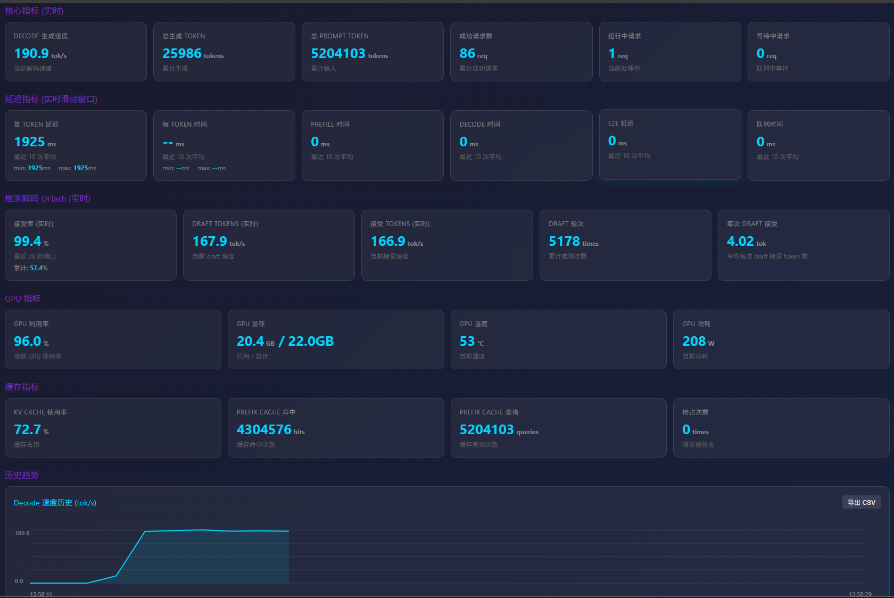
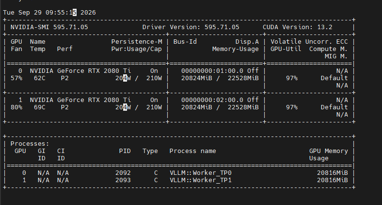
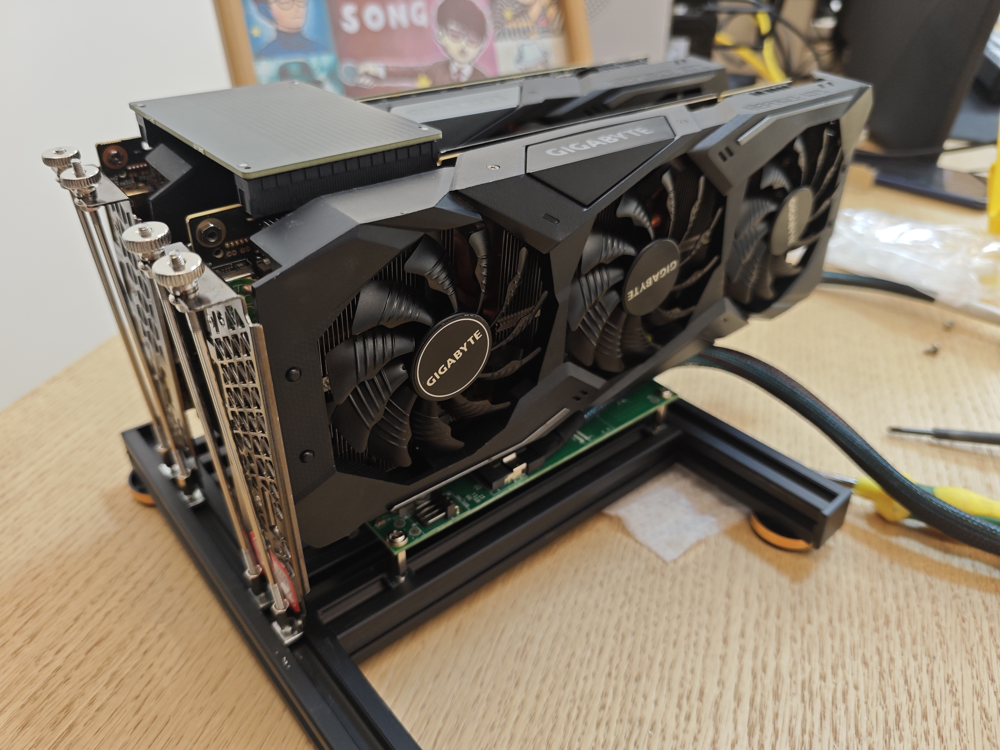
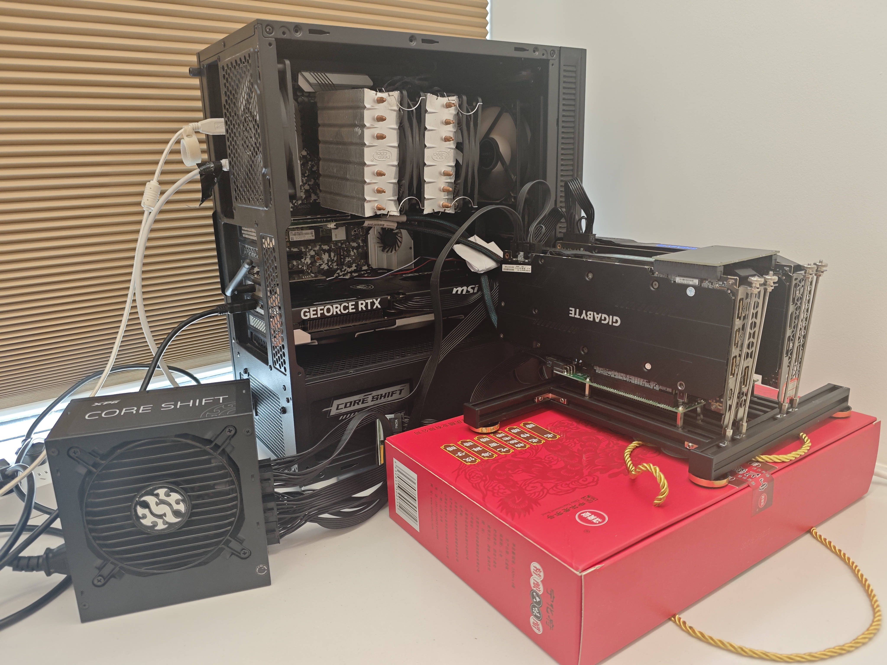
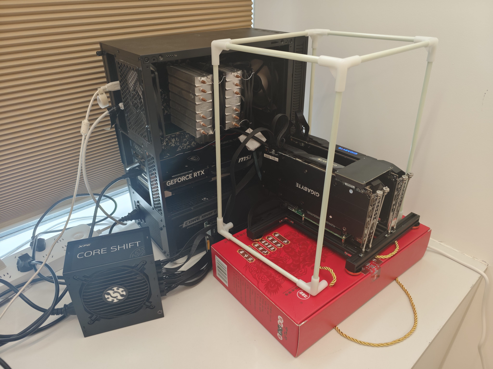
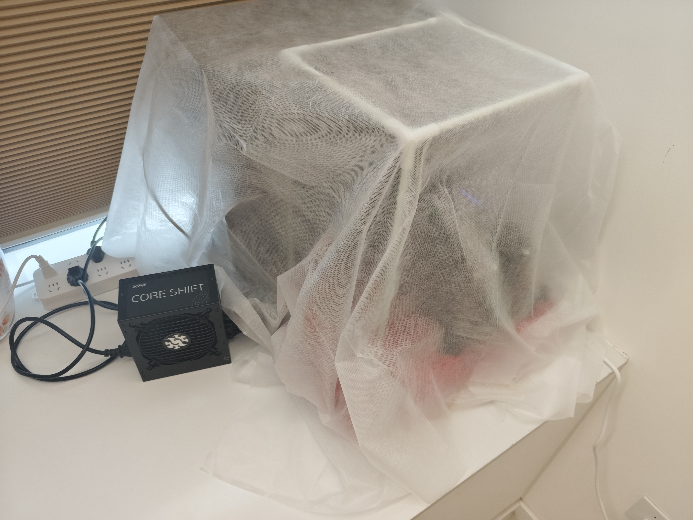

# 双 2080Ti + Qwen3.8-27B 推理服务完整配置备份

> 本项目是双 RTX 2080Ti（Turing sm_75）+ Qwen3.8-27B-NVFP4 的完整推理服务配置备份，包含代理层、vLLM 启动配置、监控页面、systemd 服务、风扇控制、Profile 配置及完整文档。

---

## 系统运行截图

### 实时监控面板



> Decode 速度 ~190 tok/s | DFlash 接受率 99.4% | GPU 温度 53°C | 功耗 208W | KV Cache 72.7%

### 硬件资源状态



> 双 RTX 2080 Ti (TP=2) | 显存 20824MiB/22528MiB | 功耗 210W/210W | GPU 利用率 97%

### 硬件组装过程






> 从 NVLink 桥接、接入主机、安装固定到防尘处理的完整组装过程

---

## 一、核心引擎：vLLM 2080 Ti Definitive Edition

**本项目的基础是 [vLLM 2080 Ti Definitive Edition](https://github.com/weicj/vLLM-2080Ti-Definitive)**——一个专门为 Turing 架构（SM75）深度修改的 vLLM fork。

### 1.1 它是什么？

vLLM 2080 Ti Definitive Edition **不是**一个配置文件集合，而是**整个推理引擎的核心**。它基于上游 vLLM，但包含了大量 SM75 专属的源码修改、启动器和验证证据，使得 27B/35B 级别的模型能在双 2080Ti 上稳定运行。

| 维度 | 上游 vLLM | vLLM 2080 Ti Definitive Edition |
|------|-----------|--------------------------------|
| 目标硬件 | Ampere/Ada/Hopper | **Turing (SM75)** |
| 支持 GPU | A100/H100/L4/4090 等 | RTX 2080Ti / T4 / T10 / TITAN RTX |
| KV Cache | FP16/BF16/FP8（硬件加速） | **FP8（软件模拟，Turing 无 FP8 硬件）** |
| 量化 | FP8/AWQ/GPTQ | **Marlin/ExLlama W4A16 + compressed-tensors** |
| 推测解码 | MTP/EAGLE | **DFlash2（Turing 专属草稿模型）** |
| Attention | FlashAttention/FlashInfer | **FlashQLA（SM70/SM75 适配版）** |
| CUDA Graph | 标准 | **FULL_AND_PIECEWISE（SM75 适配）** |

### 1.2 核心能力

该 fork 通过以下技术让双 2080Ti 跑起 27B 模型：

- **Marlin/ExLlama W4A16 算子**：INT4 权重量化，27B 模型仅需 ~14GB 显存
- **FlashQLA（Qwen 混合线性注意力）**：SM70/SM75 专属的 Gated DeltaNet 实现
- **DFlash2 推测解码**：Turing 专属草稿模型，7 tokens 并行猜测
- **TurboQuant/INT8 KV**：进一步压缩 KV Cache
- **CUDA Graph**：减少 kernel launch 开销
- **Prefix Caching**：复用已计算的 KV Cache

### 1.3 为什么需要这个 fork？

标准 vLLM 在 Turing 上会遇到：
- FP8 KV Cache 无硬件支持 → 需要软件模拟
- CUTLASS FP8 dispatch 在 SM75 上崩溃 → 需要 fallback 路径
- FlashAttention 不支持 Turing → 需要 FlashQLA
- 量化模型加载失败 → 需要 Marlin/ExLlama 路径

**没有这个 fork，双 2080Ti 根本无法运行 27B 模型。**

---

## 二、为什么不能直接用 vLLM 2080 Ti Definitive？

vLLM 2080 Ti Definitive Edition 让双 2080Ti **能跑** 27B 模型，但直接用会遇到以下问题：

### 2.1 直接用 vLLM 会遇到的问题

| 问题 | 现象 | 根因 |
|------|------|------|
| **多语种乱码雪崩** | 中文写作中突然蹦出泰语/俄语/阿拉伯语，最终退化为 `the the the` | 151K 词表 + 高温采样 + FP8 KV 误差累积，长尾 token 被激活后自回归发散 |
| **Claude Code 不兼容** | Claude Code 使用 Anthropic 协议（`/v1/messages`），vLLM 只支持 OpenAI 协议（`/v1/chat/completions`） | 协议不匹配 |
| **参数裸奔** | 客户端传什么温度就直接透传，T=1.0 时模型直接暴毙 | 代理层无采样控制 |
| **无监控** | 不知道 Prefill 花了多少时间、DFlash 接受率多少、KV Cache 还剩多少 | 缺少可视化监控 |
| **无 System Prompt 管理** | 多条 system 消息分散在 context 中，注意力被稀释 | 无消息预处理 |
| **流式冲突** | 客户端期望非流式 JSON，vLLM 强制返回 SSE 流 | 流式意图不匹配 |

### 2.2 增加代理层的原因

**核心思路**：不改 vLLM 源码，在它前面加一层轻量代理，解决上述所有问题。

```
Claude Code ──→ LiteLLM ──→ vllm-proxy ──→ vLLM 2080 Ti Definitive ──→ 双 2080Ti
(Anthropic)      (协议转换)    (参数清洗)      (推理引擎)              (硬件)
```

**为什么用代理而不是改 vLLM？**
- vLLM 是上游项目，改源码会失去与上游同步的能力
- 代理层秒级重启，不影响 vLLM 主服务
- 代理层可以独立迭代，不影响推理引擎稳定性

### 2.3 增加双模式采样策略

**问题**：Qwen3.8-27B 的 151K 词表在高温采样下会出现多语种乱码雪崩，但低温又牺牲创作多样性。

**解决方案**：在代理层实现**安全默认（Safe by Default）**的双模式采样：

```
客户端请求
  │
  ├─ 显式 temperature=0 → 贪婪模式（~200 tok/s）
  │    └─ 代码生成、基准测试、确定性任务
  │
  └─ 未传温度 或 T>0 → 安全模式（~150 tok/s）
       └─ T=0.15, top_p=0.95, top_k=50
       └─ 小说创作、日常对话、多轮长文本
```

**效果**：
- Claude Code（T=0）：~200 tok/s，零乱码
- OpenClaw（安全模式）：~150 tok/s，零乱码
- 对比：不设防时随时可能暴毙崩溃

### 2.4 增加 FastAPI 代理层

**`fastapi_proxy.py`** — 轻量级直通代理（秒级重启，不中断 vLLM）：

| 功能 | 说明 |
|------|------|
| 消息预处理 | 图片 Base64 提取、防废话指令注入 |
| System 合并 | 多条 system 消息合并为一条，减少注意力稀释 |
| 参数清洗 | 剔除 vLLM 拒收的 OpenAI 扩展参数 |
| 采样压制 | 双模式采样策略（见 2.3） |
| 流式透传 | 字节级零损耗，尊重客户端流式意图 |
| max_tokens 钳制 | 防止上下文溢出 |
| TTFT 保活 | 首字延迟前发送合法 OpenAI Chunk + X-Accel-Buffering，防止客户端超时重试 |

### 2.5 增加 LiteLLM Anthropic 适配器

**`config_claude.yaml`** — 让 Claude Code 透明接入本地 Qwen 模型：

- Claude 模型别名 → 本地 Qwen 路由
- Anthropic → OpenAI 协议转换
- 强制注入 `temperature: 0`（贪婪模式，适合代码生成）
- 所有 Claude 模型别名统一配置

### 2.6 增加实时监控面板

**`monitor.html`** — 单文件实时监控页面（端口 8080）：

- Prefill 时间 / Decode 速度
- DFlash2 推测解码接受率
- KV Cache 使用率
- GPU 显存/温度/功耗

### 2.7 增加踩坑知识库

本项目积累的 4 个血泪教训（见第九章），每一个都是实际生产中踩出来的：

1. FP8 KV Cache 是验证过的设计，不是 bug
2. 代理层参数裸奔导致乱码
3. 代码回归（删除防崩逻辑）
4. 代理层强制流式与 LiteLLM 协议冲突

**这些知识无法从上游文档获得，是本项目独有的工程价值。**

---

## 三、系统架构总览

```
┌─────────────────────────────────────────────────────────────────────┐
│                          客户端层                                    │
│  Claude Code  │  OpenClaw / WorkBuddy  │  curl / 其他 API 客户端     │
└──────┬────────┴───────────┬─────────────┴──────────────┬────────────┘
       │                    │                            │
       ▼                    ▼                            ▼
┌──────────────┐  ┌─────────────────────┐  ┌─────────────────────────┐
│ LiteLLM      │  │ vllm-proxy          │  │ 直连 vLLM              │
│ (端口 4001)  │  │ (端口 4000)         │  │ (端口 8089)            │
│              │  │                     │  │                         │
│ Anthropic    │  │ FastAPI 直通代理    │  │ 仅调试用               │
│ → OpenAI     │  │ - 消息预处理        │  │                         │
│ 协议转换     │  │ - 图片 Base64 提取  │  │                         │
│              │  │ - System 合并       │  │                         │
│ temperature  │  │ - 参数清洗          │  │                         │
│ = 0 (贪婪)   │  │ - 采样压制          │  │                         │
│              │  │ - 流式透传          │  │                         │
└──────┬───────┘  └──────────┬──────────┘  └───────────┬─────────────┘
       │                     │                        │
       └─────────────────────┼────────────────────────┘
                             ▼
              ┌──────────────────────────────────────┐
              │  vLLM 2080 Ti Definitive Edition     │
              │  (端口 8089)                         │
              │                                      │
              │  ┌────────────────────────────────┐  │
              │  │ 核心推理引擎                    │  │
              │  │                                │  │
              │  │  • Marlin W4A16 量化算子       │  │
              │  │  • FlashQLA Attention (SM75)   │  │
              │  │  • DFlash2 推测解码 (7 tokens) │  │
              │  │  • FP8 KV Cache (软件模拟)     │  │
              │  │  • CUDA Graph (FULL_AND_PIECEWISE)│ │
              │  │  • Prefix Caching              │  │
              │  │  • TurboQuant/INT8 KV          │  │
              │  └────────────────────────────────┘  │
              │                                      │
              │  模型: Qwen3.8-27B-NVFP4            │
              │  TP=2, max_model_len=262144          │
              │  max_num_seqs=1                      │
              └──────────────────────────────────────┘
                             │
                             ▼
              ┌──────────────────────────────┐
              │     双 RTX 2080Ti (TP=2)     │
              │  GPU 0: 22,528 MiB          │
              │  GPU 1: 22,528 MiB          │
              │  NVLink 互联                │
              │  功耗限制: 210W/卡          │
              └──────────────────────────────┘
```

---

## 四、数据流转图

### 2.1 Claude Code 请求链路

```
Claude Code
  │
  │  POST /v1/messages (Anthropic 格式)
  │  model: claude-3-7-sonnet-20250219
  │  stream: true
  │
  ▼
LiteLLM (端口 4001)
  │
  │  协议转换: Anthropic → OpenAI
  │  注入参数: temperature: 0
  │  路由: claude-3-7-sonnet → openai/qwen → 127.0.0.1:4000
  │
  ▼
vllm-proxy (端口 4000)
  │
  │  1. process_messages(): 图片提取 + System 合并
  │  2. clean_outer_params():
  │     - temperature=0 → 贪婪模式（放行 DFlash）
  │     - 钳制 max_tokens ≤ 16384
  │     - 剔除 parallel_tool_calls/stream_options
  │  3. stream=True → 流式透传
  │
  ▼
vLLM (端口 8089)
  │
  │  DFlash2 推测解码 (7 tokens)
  │  贪婪采样 (T=0)
  │  FP8 KV Cache
  │
  ▼
返回 SSE 流式响应 → 原路返回 → Claude Code 逐字显示
```

### 2.2 OpenClaw / WorkBuddy 请求链路

```
OpenClaw / WorkBuddy
  │
  │  POST /v1/chat/completions (OpenAI 格式)
  │  不传 temperature（或传 T>0）
  │
  ▼
vllm-proxy (端口 4000)
  │
  │  clean_outer_params():
  │  - temperature=None → 安全模式
  │  - 强制注入: T=0.15, top_p=0.95, top_k=50
  │  - 钳制 max_tokens ≤ 16384
  │
  ▼
vLLM (端口 8089)
  │
  │  DFlash2 推测解码 (7 tokens)
  │  随机采样 (T=0.15, top_k=50)
  │  FP8 KV Cache
  │
  ▼
返回 SSE 流式响应 → 客户端逐字显示
```

---

## 五、目录结构说明

```
vllm-2080ti-backup/
├── README.md                    ← 本文件（架构总览 + 配置说明）
│
├── 01-proxy/                    ← FastAPI 代理层（轻量级，秒级重启）
│   ├── fastapi_proxy.py         ← 核心代理（消息预处理 + 参数清洗 + 采样压制 + 流式透传）
│   ├── config.yaml              ← LiteLLM 通用路由配置
│   ├── config.yaml.bak          ← 旧版配置备份
│   ├── config_claude.yaml       ← LiteLLM Claude Code 专用配置（temperature=0 贪婪模式）
│   ├── merge_system.py          ← System Prompt 合并钩子
│   └── litellm.log              ← LiteLLM 运行日志
│
├── 02-vllm-config/              ← vLLM 2080 Ti Definitive Edition 启动与构建
│   ├── start_service.sh         ← 服务启动脚本（systemd 调用，含完整 vLLM 参数）
│   ├── launcher.sh              ← 交互式启动器（194KB，含参数解析/验证/健康检查）
│   ├── build.sh                 ← 完整构建脚本（含 Rust/CMake 编译）
│   ├── build_rust.sh            ← Rust 组件构建
│   ├── update.sh                ← 版本更新脚本
│   ├── dynamic_fan_control.py   ← GPU1 动态风扇控制（温度自适应转速）
│   └── fan_control.py           ← 基础风扇控制（手动/自动模式切换）
│
├── 03-monitoring/               ← 监控面板
│   └── monitor.html             ← 实时监控页面（端口 8080，显示 Prefill/Decode/接受率）
│
├── 04-docs/                     ← 项目文档
│   ├── README.md                ← vLLM 2080 Ti Definitive Edition 主文档（英文）
│   ├── README.zh-CN.md          ← 中文版
│   ├── AGENTS.md                ← AI Agent 协作规范
│   ├── CHANGELOG.md             ← 版本变更记录（v0.2.1 → v0.2.2-post2）
│   ├── SECURITY.md              ← 安全政策
│   ├── DEBUG_PROGRESS.md        ← 调试进度记录
│   ├── PROJECT_OVERVIEW.md      ← 本项目概况（含踩坑记录）
│   ├── PROJECT_RELEASE.env      ← 发布环境变量
│   ├── profiles_README.md       ← Profile 编写指南（英文）
│   ├── profiles_README.zh-CN.md ← Profile 编写指南（中文）
│   ├── profiles_2x2080Ti_README.md ← 2x2080Ti 验证数据 + FP8 KV 警告（英文）
│   └── profiles_2x2080Ti_README.zh-CN.md ← 2x2080Ti 验证数据（中文）
│
├── 05-systemd/                  ← systemd 服务定义
│   ├── vllm-qwen27b.service     ← vLLM 主推理服务（调用 start_service.sh）
│   ├── vllm-qwen27b.service.backup-* ← 服务配置备份
│   ├── vllm-proxy.service       ← FastAPI 代理服务
│   ├── litellm-claude.service   ← LiteLLM Anthropic 适配器（Claude Code 专用）
│   ├── litellm.service          ← LiteLLM 通用服务
│   ├── vllm-monitor.service     ← 监控面板服务
│   ├── vllm-monitor.service.backup-* ← 监控服务备份
│   └── nvidia-fan-control.service ← GPU1 动态风扇控制服务
│
├── 06-profiles/                 ← 当前硬件 Profile 配置（2x2080Ti）
│   ├── dflash2-fp8kv-1x262K-text-image.env  ← 当前使用（NVFP4 + DFlash2/7 + FP8 KV）
│   ├── dflash-fp8kv-2x176K-text-only.env
│   ├── mtp4-fp8kv-2x229K-text-only.env
│   ├── mtp4-tq4nc-3x262K-text-only.env
│   └── yarn-fp8kv-1x524K-text-only.env
│
├── 07-other-hardware/           ← 其他硬件 Profile 配置（2xT10 / 4xT10）
│   ├── 2xT10/                   ← 双 Tesla T10 16GB（PCIe，TP=2）
│   │   ├── README.md / README.zh-CN.md
│   │   └── qwen27b/w4a16/*.env  ← 4 个 profile（MTP3/FP8/TQ4NC/TQK8V4）
│   └── 4xT10/                   ← 四 Tesla T10 16GB（PCIe，TP=4）
│       ├── README.md / README.zh-CN.md
│       └── qwen27b/w4a16/*.env  ← 8 个 profile（DFlash2/MTP4，FP8/FP16 KV）
│
└── picture/                     ← 项目截图
    ├── monitor.png             ← vLLM 实时监控面板截图
    ├── nvidia-smi.png          ← 双卡硬件资源状态截图
    ├── 1.jpg ~ 4.jpg           ← 硬件组装过程（NVLink 桥接 → 接入主机 → 安装固定 → 防尘处理）
```

> **注意**：`02-vllm-config/` 和 `06-profiles/`、`07-other-hardware/` 中的文件属于 **vLLM 2080 Ti Definitive Edition** 项目，该项目是专门为 Turing 架构（SM75）深度修改的 vLLM fork，包含 Marlin 量化算子、FlashQLA Attention、DFlash2 推测解码等核心技术。没有这个 fork，双 2080Ti 无法运行 27B 模型。详见本文档第一章。

---

## 六、核心配置详解

### 6.1 vLLM 启动参数（实际运行）

```bash
python -m vllm.entrypoints.openai.api_server \
  --host 0.0.0.0 --port 8089 \
  --model /mnt/models/Qwen3.8-27B-NVFP4 \
  --served-model-name qwen \
  --dtype half \
  --tensor-parallel-size 2 \
  --generation-config vllm \
  --gpu-memory-utilization 0.96 \
  --max-model-len 262144 \
  --enable-chunked-prefill \
  --max-num-seqs 1 \
  --max-num-batched-tokens 2048 \
  --quantization compressed-tensors \
  --kv-cache-dtype fp8 \
  --mamba-cache-mode align \
  --enable-prefix-caching \
  --reasoning-parser qwen3 \
  --tool-call-parser qwen3_xml \
  --enable-auto-tool-choice \
  --speculative-config {"method":"dflash","num_speculative_tokens":7,"model":"/mnt/models/Qwen3.8-27B-DFlash2","attention_backend":"TRITON_ATTN","kv_cache_dtype":"float16","draft_sample_method":"greedy"} \
  --compilation-config {"cudagraph_mode":"FULL_AND_PIECEWISE","cudagraph_capture_sizes":[8],"max_cudagraph_capture_size":8}
```

### 6.2 代理层采样策略（安全默认）

```python
# fastapi_proxy.py clean_outer_params()

# 判断是否为纯贪婪请求
req_temp = body.get("temperature")
if req_temp is not None and req_temp == 0 and not isinstance(req_temp, bool):
    # 贪婪模式：放行 DFlash 满血跑分（~195-200 tok/s）
    body["temperature"] = 0
    body.pop("top_p", None)
    body.pop("top_k", None)
    body.pop("repetition_penalty", None)
else:
    # 安全模式：焊死防乱码铁壁（~142-160 tok/s）
    body["temperature"] = 0.15
    body["top_p"] = 0.95
    body["top_k"] = 50
    body.pop("repetition_penalty", None)
```

### 6.3 LiteLLM Claude Code 配置

```yaml
# config_claude.yaml
model_list:
  - model_name: claude-3-7-sonnet-20250219
    litellm_params:
      model: openai/qwen
      api_base: http://127.0.0.1:4000/v1
      api_key: sk-dummy
      temperature: 0          # 强制贪婪模式
      drop_params: true
```

### 6.4 当前使用的 Profile

```ini
# dflash2-fp8kv-1x262K-text-image.env
MODEL_FAMILY=qwen35
MODEL_VARIANT=nvfp4
QUANTIZATION=compressed-tensors
KV_CACHE_DTYPE=fp8
MAX_MODEL_LEN=262144
GPU_UTIL=0.96
MAX_NUM_SEQS=1
SPECULATIVE_METHOD=dflash
SPECULATIVE_TOKENS=7
MESSAGE_TYPE=text+image
```

---

## 七、性能数据

| 场景 | 采样模式 | Decode 速度 | 稳定性 |
|------|----------|-------------|--------|
| Claude Code (T=0) | 贪婪 | ~195-200 tok/s | 零乱码 |
| OpenClaw/WorkBuddy (T=0.15) | 随机 | ~142-160 tok/s | 零乱码 |
| 云端 DeepSeek-V3 API | - | 30-60 tok/s | - |
| 云端 Claude 3.5/3.7 API | - | 40-70 tok/s | - |

---

## 八、风扇控制与散热管理

### 8.1 问题背景

双 RTX 2080Ti 满载推理时，GPU1 温度可达 **88°C**（接近 89°C 降频阈值），需要主动散热管理。

### 8.2 解决方案

| 组件 | 说明 |
|------|------|
| `dynamic_fan_control.py` | GPU1 动态风扇控制（根据温度自动调整转速） |
| `fan_control.py` | 基础风扇控制（手动/自动模式切换） |
| `nvidia-fan-control.service` | systemd 服务，开机自动启动动态风扇控制 |

### 8.3 温控规则

| GPU1 温度 | 风扇转速 |
|-----------|----------|
| < 60°C | 60% |
| ≥ 60°C | 80% |
| ≥ 75°C | 90% |
| ≥ 85°C | 100% |

### 8.4 前置依赖

```bash
# 启用 Coolbits（解锁手动风扇控制）
sudo nvidia-xconfig --cool-bits=4

# 安装 Xvfb（虚拟显示，nvidia-settings 需要）
sudo apt install xvfb
Xvfb :99 -screen 0 1280x1024x24 &
export DISPLAY=:99
```

### 8.5 常用命令

```bash
# 查看风扇控制服务状态
sudo systemctl status nvidia-fan-control.service

# 查看实时日志
sudo journalctl -u nvidia-fan-control.service -f

# 手动设置 GPU1 风扇转速
nvidia-settings -a "[gpu:1]/GPUFanControlState=1"
nvidia-settings -a "[fan:1]/GPUTargetFanSpeed=80"

# 恢复 GPU1 自动风扇
nvidia-settings -a "[gpu:1]/GPUFanControlState=0"
```

---

## 九、已踩过的坑（血泪教训）

### 坑 1：FP8 KV Cache 不是 bug，是验证过的设计

**错误认知**：Turing（sm_75）没有 FP8 硬件单元，开 `--kv-cache-dtype fp8` 是配置错误。

**事实**：项目文档明确写道 `NVFP4 W4A16 FP16KV has a significant quality-collapse issue`。NVFP4 + FP8 KV 是唯一验证可行的组合。

**教训**：改配置前先读项目文档，不要基于硬件常识想当然。

### 坑 2：代理层参数裸奔

**问题**：`clean_outer_params()` 原本不设置任何采样参数，客户端传什么温度就直接透传。

**修复**：在 proxy 层强制覆盖 `temperature=0.15, top_p=0.95, top_k=50`。

### 坑 3：代码回归——删除了防崩逻辑

**问题**：添加采样参数时删除了 `max_tokens` 钳制和 `user/extra_body` 清理。

**教训**：修改已有函数时，必须保留所有现有逻辑，只做增量添加。

### 坑 4：代理层强制流式与 LiteLLM 协议冲突

**问题**：`body["stream"] = True` 强制覆盖，导致 LiteLLM 非流式请求解析失败。

**修复**：改为 `if "stream" not in body: body["stream"] = True`，尊重客户端意图。

---

## 十、常用运维命令

```bash
# 重启代理层（秒级生效，不中断 vLLM）
sudo systemctl restart vllm-proxy

# 重启 vLLM 主服务（有中断）
sudo systemctl restart vllm-qwen27b

# 重启 LiteLLM
sudo systemctl restart litellm-claude

# 查看服务状态
systemctl status vllm-proxy
systemctl status vllm-qwen27b
systemctl status litellm-claude

# 查看实时日志
journalctl -u vllm-proxy -f
journalctl -u vllm-qwen27b -f

# GPU 状态
nvidia-smi

# 测试代理（贪婪模式）
curl -s http://127.0.0.1:4000/v1/chat/completions \
  -H "Content-Type: application/json" \
  -d '{"model":"qwen","messages":[{"role":"user","content":"你好"}],"temperature":0,"max_tokens":50}'

# 测试代理（安全模式）
curl -s http://127.0.0.1:4000/v1/chat/completions \
  -H "Content-Type: application/json" \
  -d '{"model":"qwen","messages":[{"role":"user","content":"你好"}],"max_tokens":50}'
```

---

## 十一、服务端口总览

| 端口 | 服务 | 说明 |
|------|------|------|
| 8089 | vLLM | 主推理服务 |
| 4000 | vllm-proxy | FastAPI 代理层 |
| 4001 | litellm-claude | LiteLLM Anthropic 适配器 |
| 8080 | vllm-monitor | 监控面板 |

---

## 十二、其他硬件 Profile（2xT10 / 4xT10）

vLLM 2080 Ti Definitive Edition 不仅支持双 2080Ti，还验证了 Tesla T10 系列：

| 硬件 | 拓扑 | Profile 数量 | 说明 |
|------|------|-------------|------|
| 2x T10 16GB | TP=2（PCIe） | 4 个 | MTP3/FP8/TQ4NC/TQK8V4 |
| 4x T10 16GB | TP=4（PCIe） | 8 个 | DFlash2/MTP4，FP8/FP16 KV |

这些 profile 位于 `07-other-hardware/` 目录，可供参考。

---

## 十三、硬件信息

| 维度 | 配置 |
|------|------|
| GPU | 双 RTX 2080Ti（Turing sm_75） |
| 显存 | 各 22,528 MiB，NVLink 互联 |
| 功耗限制 | 210W/卡 |
| 驱动模式 | 常驻模式（nvidia-smi -pm 1） |
| GPU0 风扇 | 自动模式 |
| GPU1 风扇 | 动态控制（<60°C→60%, ≥60°C→80%, ≥75°C→90%, ≥85°C→100%） |
| 温度 | 空闲 40-43°C，满载 <85°C |

---

*最后更新：2026-09-29*
*基于 vLLM 2080 Ti Definitive Edition v0.2.2-post2*
